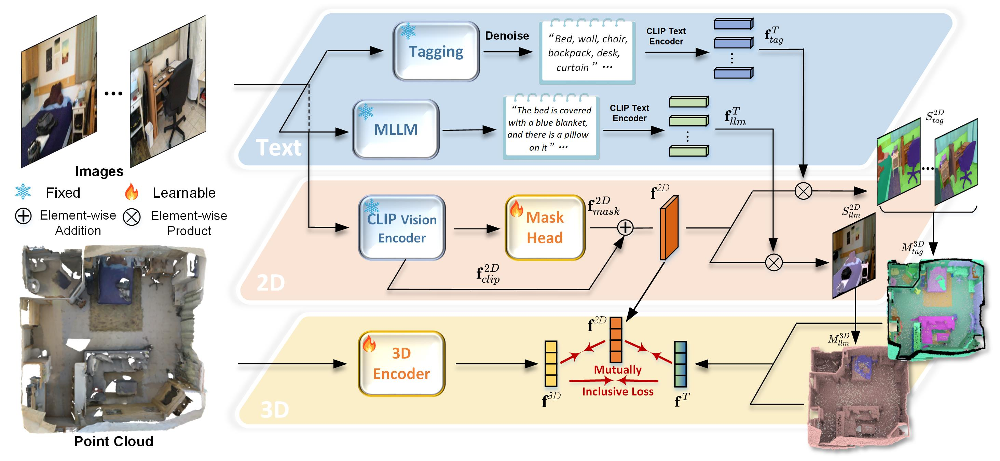

# Dense Multimodal Alignment for Open-Vocabulary 3D Scene Understanding, ECCV2024

### [Paper]() 

This repo is the official implementation of the work DMA.

## Abstract
Recent vision-language pre-training models have exhibited remarkable generalization ability in zero-shot recognition tasks. Previous open-vocabulary 3D scene understanding methods mostly focus on training 3D models using either image or text supervision while neglecting the collective strength of all modalities. In this work, we propose a Dense Multimodal Alignment (DMA) framework to densely co-embed different modalities into a common space for maximizing their synergistic benefits. Instead of extracting coarse view- or region-level text prompts, we leverage large vision-language models to extract complete category information and scalable scene descriptions to build the text modality, and take image modality as the bridge to build dense point-pixel-text associations. Besides, in order to enhance the generalization ability of the 2D model for downstream 3D tasks without compromising the open-vocabulary capability, we employ a dual-path integration approach to combine frozen CLIP visual features and learnable mask features. Extensive experiments show that our DMA method produces highly competitive open-vocabulary segmentation performance on various indoor and outdoor tasks. 



## News
- **2024.07.02**: DMA is accepted by ECCV 2024!

## Data Preparation 
Download [Cityscapes](https://www.cityscapes-dataset.com/), [GTA5](https://download.visinf.tu-darmstadt.de/data/from_games/) and [SYNTHIA-RAND-CITYSCAPES](http://synthia-dataset.net/downloads/).

We expect the folders to be like
```
└── data
    ├── cityscapes
    │   ├── annotations
    │   ├── gtFine
    │   └── leftImg8bit
    ├── GTA5
    │   ├── images
    │   ├── labels
    │   └── split.mat
    ├── SYNTHIA
    │   ├── GT
    │   ├── RGB
    └── └── meta.json

```

## Citation
If our work is useful for your research, please consider citing:

    @inproceedings{li2024dense,
        author = {Ruihuang, Li and Zhengqiang, Zhang and Chenhang, He and Zhiyuan, Ma and Vishal M., Patel and Lei, Zhang},
        title = {Dense Multimodal Alignment for Open-Vocabulary 3D Scene Understanding},
        booktitle = {ECCV},
        year = {2024}
    }

## Acknowledgement
This project is based on [OpenScene](https://github.com/pengsongyou/openscene). Thanks for their awesome work.
