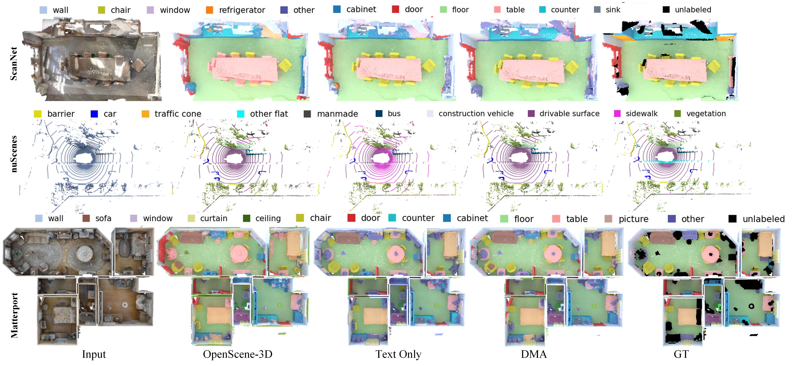

# Dense Multimodal Alignment for Open-Vocabulary 3D Scene Understanding, ECCV2024

### [Paper](https://arxiv.org/abs/2407.09781) 

This repo is the official implementation of the work DMA.

## Abstract
Recent vision-language pre-training models have exhibited remarkable generalization ability in zero-shot recognition tasks. Previous open-vocabulary 3D scene understanding methods mostly focus on training 3D models using either image or text supervision while neglecting the collective strength of all modalities. In this work, we propose a Dense Multimodal Alignment (DMA) framework to densely co-embed different modalities into a common space for maximizing their synergistic benefits. Instead of extracting coarse view- or region-level text prompts, we leverage large vision-language models to extract complete category information and scalable scene descriptions to build the text modality, and take image modality as the bridge to build dense point-pixel-text associations. Besides, in order to enhance the generalization ability of the 2D model for downstream 3D tasks without compromising the open-vocabulary capability, we employ a dual-path integration approach to combine frozen CLIP visual features and learnable mask features. Extensive experiments show that our DMA method produces highly competitive open-vocabulary segmentation performance on various indoor and outdoor tasks. 


## News
- **2024.07.02**: DMA is accepted by ECCV 2024!

## Data Preparation 

We expect the folders to be like
```
└── data
    ├── data_scannet
    │   ├── scannet_2d
    │   ├── scannet_3d
    │   ├── scannet_200
    │   ├── scannet_multiview_openseg
    │   └── scannet_multiview_lseg 
    ├── data_nus
    │   ├── nuscenes_2d
    │   ├── nuscenes_3d
    │   ├── nuscenes_multiview_openseg
    │   ├── nuscenes_multiview_openseg_val
    │   └── nuscenes_multiview_fcclip
    ├── data_matterport
    │   ├── matterport_2d
    │   ├── matterport_3d
    │   ├── matterport_3d_40
    │   ├── matterport_3d_80
    │   ├── matterport_3d_160
    │   ├── matterport_multiview_openseg
    └── └── matterport_multiview_openseg_test
└── output
    ├── output_scannet
    ├── output_scannet200
    ├── output_nuscenes
    └── output_matterport
```

## Evaluation
#Scannet
```bash
python -u evaluate.py   --config=./config/scannet/ours_openseg.yaml   feature_type distill  save_folder ./save
```
#Scannet200
```bash
python -u evaluate.py   --config=./config/scannet/ours_openseg_200.yaml   feature_type distill  save_folder ./save
```
#Scannet200-Head/Common/Tail classes
```bash
python -u evaluate.py   --config=./config/scannet/ours_openseg_200.yaml   feature_type distill  save_folder ./save class_split head/common/tail
```
#nuScenes
```bash
python -u evaluate.py   --config=./config/nuscenes/ours_openseg.yaml   feature_type distill  save_folder ./save
```
#matterport
```bash
python -u evaluate.py   --config=./config/matterport/ours_openseg.yaml   feature_type distill  save_folder ./save
```
#matterport 40/80/160 classes
```bash
python -u evaluate.py   --config=./config/matterport/test_40/80/160classes.yaml   feature_type distill  save_folder ./save
```
## Qualitative Results


## Citation
If our work is useful for your research, please consider citing:

    @inproceedings{li2024dense,
        author = {Ruihuang, Li and Zhengqiang, Zhang and Chenhang, He and Zhiyuan, Ma and Vishal M., Patel and Lei, Zhang},
        title = {Dense Multimodal Alignment for Open-Vocabulary 3D Scene Understanding},
        booktitle = {ECCV},
        year = {2024}
    }

## Acknowledgement
This project is based on [OpenScene](https://github.com/pengsongyou/openscene). Thanks for their awesome work.
